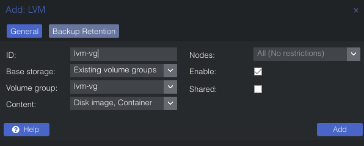

# Setup

## Provisioning Proxmox

Installing proxmox is straight forward Download boot ISO, flash to a USB and configure via GUI.

## Additional LVM Storage

Once proxmox is installed, add additional storage choose `Datacenter` > `Storage` > `Add` > `LVM`



## Run proxmox playbook

[Proxmox prepare playbook](../provision/ansible/playbooks/proxmox-prepare.yml)

Playbook does several things:

* Install dark theme
* Create terraform role, user and access control
* Create ubuntu cloud init template
* Enable correct proxmox repositories
* Disable subscription nag

```bash
task ansible:prepare-proxmox
```

## k3s node

* [Terraform](../provision/terraform/proxmox/00-vm) to create a VM based on ubuntu template for k3s node

```bash
task terraform:proxmox-apply DIR=provision/terraform/proxmox/00-vm
```

## Baremetal OCP installation on Proxmox

* Provision a Service VM using [Terraform](../provision/terraform/proxmox/10-vm/) and Setup Haproxy, PXE boot and NFS server using Ansible [role](../provision/ansible/roles/ocp4/)
* [Install Playbook](../provision/ansible/playbooks/ocp4-install.yml)

  * Create bootstrap, master and worker VMs
  * Wait for bootstrap process to finish
  * Approve pending CSRs

    ```bash
    task ansible:ocp4-install
    ```

* [Post install Playbook](../provision/ansible/playbooks/ocp4-post-install.yml)

  * Create htpasswd user and add new identity provider
  * Install cert-manager, openshift-gitops operator
  * Create cert manager cluster-issuer object
  * Create certificate
  * Update APIServer and Ingress operator with new certificates
  * Update ArgoCD instance with ingress and KSOPS plugin

    ```bash
    task ansible:ocp4-post-install
    ```

## Resources

* [Eth issue](https://forum.proxmox.com/threads/e1000e-unexpected-adapter-resets.89459/)
* [Proxmox helper scripts](https://tteck.github.io/Proxmox/)
* [Proxmox OCP playbooks](https://github.com/Keyvan-rh/Proxmox-OCP-Installer)
